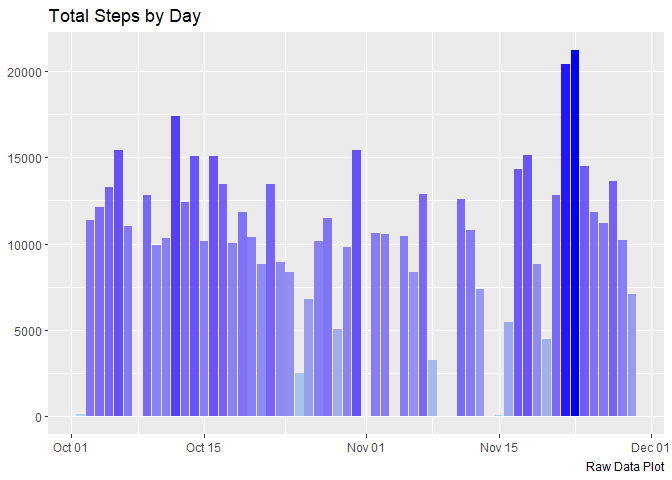
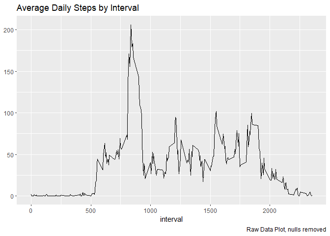
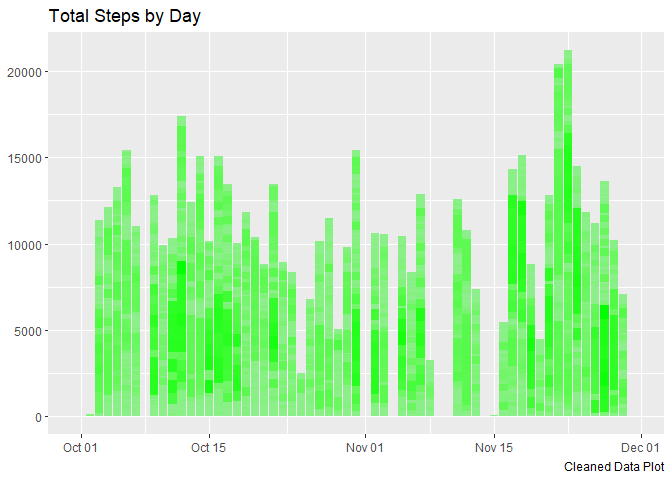
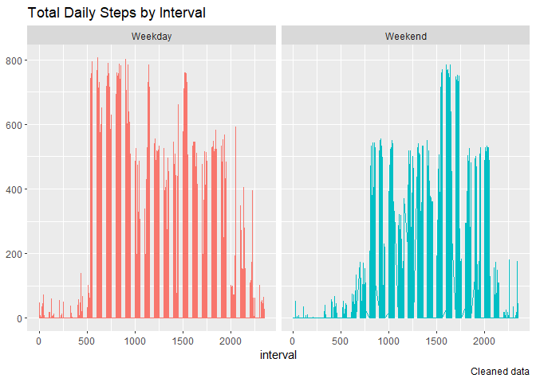

## Load libraries


```r
library(tidyverse)
```

```
## -- Attaching packages --------------------------------------- tidyverse 1.3.1 --
```

```
## v ggplot2 3.3.5     v purrr   0.3.4
## v tibble  3.1.6     v dplyr   1.0.8
## v tidyr   1.2.0     v stringr 1.4.0
## v readr   2.1.2     v forcats 0.5.1
```

```
## Warning: package 'dplyr' was built under R version 4.1.3
```

```
## -- Conflicts ------------------------------------------ tidyverse_conflicts() --
## x dplyr::filter() masks stats::filter()
## x dplyr::lag()    masks stats::lag()
```

```r
library(ggplot2)
library(tidyr)
library(dplyr)
```
## Loading and preprocessing the data

Let's read the csv and unpack it from the zip file. Assign it to a df


```r
activity_raw_df <-read.csv(unz('activity.zip','activity.csv'),header = T)
head(activity_raw_df)
```

```
##   steps       date interval
## 1    NA 2012-10-01        0
## 2    NA 2012-10-01        5
## 3    NA 2012-10-01       10
## 4    NA 2012-10-01       15
## 5    NA 2012-10-01       20
## 6    NA 2012-10-01       25
```

Let's get some stats on the raw data.


```r
summary(activity_raw_df)
```

```
##      steps            date              interval     
##  Min.   :  0.00   Length:17568       Min.   :   0.0  
##  1st Qu.:  0.00   Class :character   1st Qu.: 588.8  
##  Median :  0.00   Mode  :character   Median :1177.5  
##  Mean   : 37.38                      Mean   :1177.5  
##  3rd Qu.: 12.00                      3rd Qu.:1766.2  
##  Max.   :806.00                      Max.   :2355.0  
##  NA's   :2304
```
I notice that the date is in character format. I think this would be better in a date format for creating plots, and just for analytic purposes.


```r
library(lubridate)
```

```
## 
## Attaching package: 'lubridate'
```

```
## The following objects are masked from 'package:base':
## 
##     date, intersect, setdiff, union
```

```r
activity_raw_df$date <- ymd(activity_raw_df$date)

str(activity_raw_df)
```

```
## 'data.frame':	17568 obs. of  3 variables:
##  $ steps   : int  NA NA NA NA NA NA NA NA NA NA ...
##  $ date    : Date, format: "2012-10-01" "2012-10-01" ...
##  $ interval: int  0 5 10 15 20 25 30 35 40 45 ...
```
Looks like the date field is now in date f <-format. Yeah!

## What is mean total number of steps taken per day?

First, let's do the histogram of steps per day.


```r
# first select data and organize it.

raw_data_steps <- activity_raw_df %>% 
      select (date, steps) %>%
      group_by(date) %>% 
      summarise(total_daily_steps = sum(steps))
      
  
    ggplot(data = raw_data_steps,mapping = aes(x=date, y=total_daily_steps, fill=total_daily_steps))+
              geom_bar(stat="identity")+
              scale_fill_continuous(low="light blue", high = "blue")+
              theme(legend.position = "none",                                          axis.title.x=element_blank(),axis.title.y=element_blank())+
              ggtitle("Total Steps by Day")+
              labs(caption = "Raw Data Plot")
```

```
## Warning: Removed 8 rows containing missing values (position_stack).
```

<!-- -->
Now to calculate the mean and median of steps per day. Just using summary on the df.


```r
summary(raw_data_steps)
```

```
##       date            total_daily_steps
##  Min.   :2012-10-01   Min.   :   41    
##  1st Qu.:2012-10-16   1st Qu.: 8841    
##  Median :2012-10-31   Median :10765    
##  Mean   :2012-10-31   Mean   :10766    
##  3rd Qu.:2012-11-15   3rd Qu.:13294    
##  Max.   :2012-11-30   Max.   :21194    
##                       NA's   :8
```
# What is the average daily activity pattern?

Create a time series plot of the average daily steps (y axis) of the 5 minute interval (x axis) average all days.


```r
# Get the data in the right format for the plot.

raw_data_interval <- activity_raw_df %>% 
      select (interval, date, steps) %>%
      na.omit()  %>% 
      group_by(interval ) %>% 
      summarise(avg_daily_steps = mean(steps))

ggplot(data = raw_data_interval,mapping = aes(x=interval, y=avg_daily_steps))+
              geom_line()+
              
              theme(legend.position = "none",                                          axis.title.x = element_text("Interval"),axis.title.y=element_blank())+
              ggtitle("Average Daily Steps by Interval")+
              labs(caption = "Raw Data Plot, nulls removed")
```

```
## Warning in grid.Call(C_stringMetric, as.graphicsAnnot(x$label)): font family not
## found in Windows font database
```

```
## Warning in grid.Call(C_textBounds, as.graphicsAnnot(x$label), x$x, x$y, : font
## family not found in Windows font database

## Warning in grid.Call(C_textBounds, as.graphicsAnnot(x$label), x$x, x$y, : font
## family not found in Windows font database

## Warning in grid.Call(C_textBounds, as.graphicsAnnot(x$label), x$x, x$y, : font
## family not found in Windows font database
```

<!-- -->
Which interval has the highest average number of daily steps?

Using arrange on the data frame. Looks like 835 is the interval with the maximum daily steps.


```r
# arrange(raw_data_interval,desc(avg_daily_steps))
# head()
```
## Imputing missing values
 Calculate the total number of missing values coded as NA

```r
 summary(activity_raw_df)
```

```
##      steps             date               interval     
##  Min.   :  0.00   Min.   :2012-10-01   Min.   :   0.0  
##  1st Qu.:  0.00   1st Qu.:2012-10-16   1st Qu.: 588.8  
##  Median :  0.00   Median :2012-10-31   Median :1177.5  
##  Mean   : 37.38   Mean   :2012-10-31   Mean   :1177.5  
##  3rd Qu.: 12.00   3rd Qu.:2012-11-15   3rd Qu.:1766.2  
##  Max.   :806.00   Max.   :2012-11-30   Max.   :2355.0  
##  NA's   :2304
```
Looks to be 2304 NA's in the steps column.

*Devise a strategy for filling in the missing values*

Going to use the activity_raw_df created earlier. This had the dates converted to a date field. Decided to use median steps to replace NA's.


```r
activity_cleaned_df <-activity_raw_df %>%
    mutate(steps=replace_na(steps,median(steps,na.rm = TRUE)))
summary(activity_cleaned_df)
```

```
##      steps             date               interval     
##  Min.   :  0.00   Min.   :2012-10-01   Min.   :   0.0  
##  1st Qu.:  0.00   1st Qu.:2012-10-16   1st Qu.: 588.8  
##  Median :  0.00   Median :2012-10-31   Median :1177.5  
##  Mean   : 32.48   Mean   :2012-10-31   Mean   :1177.5  
##  3rd Qu.:  0.00   3rd Qu.:2012-11-15   3rd Qu.:1766.2  
##  Max.   :806.00   Max.   :2012-11-30   Max.   :2355.0
```
Now put into same format as the steps df earlier.


```r
clean_data_steps <- activity_cleaned_df %>% 
      select (date, steps, interval) %>%
      group_by(date,interval) %>% 
      summarise(total_daily_steps = sum(steps))
```

```
## `summarise()` has grouped output by 'date'. You can override using the
## `.groups` argument.
```

```r
      summary(clean_data_steps)
```

```
##       date               interval      total_daily_steps
##  Min.   :2012-10-01   Min.   :   0.0   Min.   :  0.00   
##  1st Qu.:2012-10-16   1st Qu.: 588.8   1st Qu.:  0.00   
##  Median :2012-10-31   Median :1177.5   Median :  0.00   
##  Mean   :2012-10-31   Mean   :1177.5   Mean   : 32.48   
##  3rd Qu.:2012-11-15   3rd Qu.:1766.2   3rd Qu.:  0.00   
##  Max.   :2012-11-30   Max.   :2355.0   Max.   :806.00
```

A pretty big change in median and mean steps once we replaced the NA's. Before, it was 10,765 for mean and median steps. As you can see above from the clean_data_steps summary, the mean and median have dropped to 9,354 and 10,395, respectively.

Now, for the histogram...

```r
  ggplot(data = clean_data_steps,mapping = aes(x=date, y=total_daily_steps, fill=total_daily_steps))+
              geom_bar(stat="identity")+
              scale_fill_continuous(low="light green", high = "green")+
              theme(legend.position = "none",                                          axis.title.x=element_blank(),axis.title.y=element_blank())+
              ggtitle("Total Steps by Day")+
              labs(caption = "Cleaned Data Plot")
```

<!-- -->

## Are there differences in activity patterns between weekdays and weekends?

First things first, need to create a factor variable for weekday vs. weekend. I am going to modify the clean_data_steps data frame we just created with the imputed values for steps...


```r
clean_data_steps_dow <- clean_data_steps %>% 
      mutate(dow = wday(date,label = TRUE)) %>% 
      mutate(dow_group = case_when(dow == "Sat"  ~ 'Weekend',
                                   dow == "Sun" ~ 'Weekend',
                                   dow == "Mon" ~ 'Weekday',
                                   dow == "Tue" ~ 'Weekday',
                                   dow == "Wed" ~ 'Weekday',
                                   dow == "Thu" ~ 'Weekday',
                                   dow == "Fri" ~ 'Weekday'))
```
Now the weekday column is part of the df.  Let's do the plots..


```r
ggplot(data = clean_data_steps_dow,mapping = aes(x=interval, y=total_daily_steps, color = dow_group))+
              geom_line()+
              facet_wrap(~ dow_group)+
              
              theme(legend.position = "none",                                          axis.title.x = element_text("Interval"),axis.title.y=element_blank())+
              ggtitle("Total Daily Steps by Interval")+
              labs(caption = "Cleaned data")
```

```
## Warning in grid.Call(C_textBounds, as.graphicsAnnot(x$label), x$x, x$y, : font
## family not found in Windows font database

## Warning in grid.Call(C_textBounds, as.graphicsAnnot(x$label), x$x, x$y, : font
## family not found in Windows font database

## Warning in grid.Call(C_textBounds, as.graphicsAnnot(x$label), x$x, x$y, : font
## family not found in Windows font database
```

<!-- -->
Made 1 change so I could do a subsequent commit.


